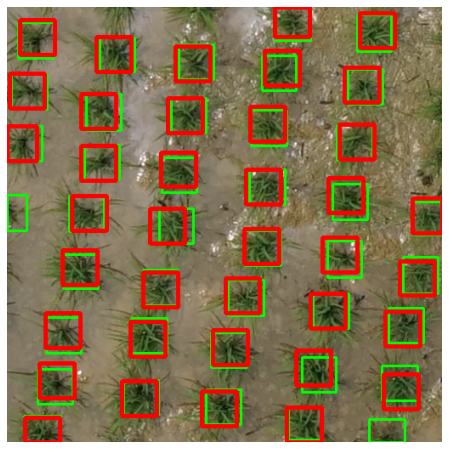

# Paddy_Recognition_faster_RCNN
This is the code using only the sample data on [水稻無人機全彩影像植株位置自動標註與應用(第一階段)](https://aidea-web.tw/topic/9c88c428-0aa7-480b-85e0-2d8fb2fcf3fc)

The competition is held by 臺灣大學農藝系

The faster RCNN model helps finding out the bounding box of the rice.

Some potential application will be to spread the pesticide precisely and also predict the yeild.

Red boxes are Ground Truth(centrel +-20 pixel)
Green boxes are the predictions

